<picture>
  <source media="(prefers-color-scheme: dark)" srcset="./assets/banner-dark.svg" />
  <source media="(prefers-color-scheme: light)" srcset="./assets/banner-light.svg" />
  
</picture>

## About

I build production systems for two runtimes: Roblox and the browser.

On Roblox that means module frameworks, replication and networking layers, persistence with profile-style session locking, monetisation pipelines, anti-exploit boundaries, and Studio tooling. On the web it means React and Next.js applications, dashboards, and internal developer tools. The common thread is the same discipline in both places — clear module boundaries, a server that owns authority, predictable performance under load, and code that is still readable six months later.

I run **AlvaStudio Community**, a Roblox development studio focused on system engineering and shipping systems that hold up in production rather than demos that only work on the first run.

## Engineering domains

<table>
<tr>
<td width="50%" valign="top">

**Roblox / Luau**

- Module framework and service lifecycle design
- Client–server architecture, server-as-authority
- Remote layer design, payload budgeting, rate limiting
- Data persistence, session locking, migration and versioning
- Monetisation: receipt processing, idempotent grants
- Anti-exploit boundaries and server-side validation
- Scheduler design, Heartbeat budgeting, instance streaming
- UI systems, state-driven interfaces, layout scaling
- Studio plugin and static analysis tooling
- Profiling, memory tracing, production hardening

</td>
<td width="50%" valign="top">

**Web / Frontend**

- React and Next.js application architecture
- TypeScript, strict typing and API contracts
- Component systems and design tokens
- Dashboards, admin panels and internal tools
- REST integration, caching and error boundaries
- Responsive layout and accessibility baseline
- Build tooling, Vite, bundle and asset budgets
- Node.js services and automation scripts
- Rendering performance, Core Web Vitals
- Deployment pipelines and preview environments

</td>
</tr>
</table>

## How I work

| Principle | In practice |
| --- | --- |
| Server owns authority | Clients send intent, never outcomes. Every state change is validated server-side before it is trusted. |
| One responsibility per module | A module that touches data, UI and networking at once is a refactor waiting to happen. |
| Budget before optimising | Measure the tick, the payload and the frame first. Optimisation without a number is guesswork. |
| Fail loudly in development | Silent `pcall` swallowing is how production bugs stay invisible for months. |
| Design for the second developer | Naming, structure and comments assume someone else maintains this next quarter. |
| Ship reversibly | Versioned data, feature flags and migrations, so a bad release is a rollback rather than an incident. |

## Stack

## Metrics

<picture>
  <source media="(prefers-color-scheme: dark)" srcset="https://github-readme-stats.vercel.app/api?username=FreezyleAlva&show_icons=true&hide_border=true&include_all_commits=true&rank_icon=github&cache_seconds=86400&bg_color=00000000&title_color=FFB245&text_color=AFC0D8&icon_color=FFB245" />
  <source media="(prefers-color-scheme: light)" srcset="https://github-readme-stats.vercel.app/api?username=FreezyleAlva&show_icons=true&hide_border=true&include_all_commits=true&rank_icon=github&cache_seconds=86400&bg_color=00000000&title_color=B4650A&text_color=33445E&icon_color=B4650A" />
  
</picture>
<picture>
  <source media="(prefers-color-scheme: dark)" srcset="https://github-readme-stats.vercel.app/api/top-langs/?username=FreezyleAlva&layout=compact&langs_count=8&hide_border=true&cache_seconds=86400&bg_color=00000000&title_color=FFB245&text_color=AFC0D8" />
  <source media="(prefers-color-scheme: light)" srcset="https://github-readme-stats.vercel.app/api/top-langs/?username=FreezyleAlva&layout=compact&hide_border=true&cache_seconds=86400&bg_color=00000000&title_color=B4650A&text_color=33445E" />
  
</picture>

<picture>
  <source media="(prefers-color-scheme: dark)" srcset="https://streak-stats.demolab.com?user=FreezyleAlva&hide_border=true&background=00000000&stroke=1C2740&ring=FFB245&fire=FFB245&currStreakNum=E8EEF9&currStreakLabel=FFB245&sideNums=AFC0D8&sideLabels=AFC0D8&dates=6F819C" />
  <source media="(prefers-color-scheme: light)" srcset="https://streak-stats.demolab.com?user=FreezyleAlva&hide_border=true&background=00000000&stroke=D6DEEA&ring=B4650A&fire=B4650A&currStreakNum=0A1120&currStreakLabel=B4650A&sideNums=33445E&sideLabels=33445E&dates=5A6A82" />
  
</picture>

Why these cards sometimes fail to load

 

They are rendered by shared third-party services, not by GitHub. The public instances are rate limited per IP and per GitHub API quota, so a card can return a placeholder during traffic spikes. `cache_seconds` above reduces how often the endpoint is hit. For deterministic rendering, deploy a private instance of [github-readme-stats](https://github.com/anuraghazra/github-readme-stats) and point the URLs at it, or generate the cards as static SVGs from a scheduled workflow and commit them to this repository.

## Contribution graph

<picture>
  <source media="(prefers-color-scheme: dark)" srcset="https://raw.githubusercontent.com/FreezyleAlva/FreezyleAlva/output/snake-dark.svg" />
  <source media="(prefers-color-scheme: light)" srcset="https://raw.githubusercontent.com/FreezyleAlva/FreezyleAlva/output/snake-light.svg" />
  
</picture>

## Contact

| Channel | Link |
| --- | --- |
| Studio | [studio.alvacommunity.biz.id](https://studio.alvacommunity.biz.id) |
| Roblox group | [AlvaStudio Community](https://www.roblox.com/groups/295556419) |
| GitHub | [@FreezyleAlva](https://github.com/FreezyleAlva) |

Open to collaboration on Roblox system engineering, frontend architecture, dashboard platforms and developer tooling.

Building scalable software and Roblox systems through clean architecture, measurable performance and code that survives maintenance.

## Arcade loop

<picture>
  <source media="(prefers-color-scheme: dark)" srcset="./assets/arcade-dark.svg" />
  <source media="(prefers-color-scheme: light)" srcset="./assets/arcade-light.svg" />
  
</picture>

