# ⚡ FreezyleAlva
### *Systems Architect | Roblox & Web Dev*

<picture>
  <source media="(prefers-color-scheme: dark)" srcset="./assets/banner-dark.svg" />
  <source media="(prefers-color-scheme: light)" srcset="./assets/banner-light.svg" />
  
</picture>

 

---
### 🚀 Tech Stack
`React` `Next.js` `TypeScript` `Luau` `Node.js` `Vite` `Tailwind` `Rojo`

## 🏗️ Systems Engineering
| Domain | Focus |
| :--- | :--- |
| **Roblox** | Replication, Session Locking, Monetization, Anti-Exploit |
| **Web** | React/Next.js Architecture, API Contracts, Dashboards |

## 🕹️ Interactive

<picture>
  <source media="(prefers-color-scheme: dark)" srcset="https://raw.githubusercontent.com/FreezyleAlva/FreezyleAlva/main/assets/snake-dark.svg" />
  <source media="(prefers-color-scheme: light)" srcset="https://raw.githubusercontent.com/FreezyleAlva/FreezyleAlva/main/assets/snake-light.svg" />
  
</picture>

---
*Code is poetry. Architecture is the foundation.*

